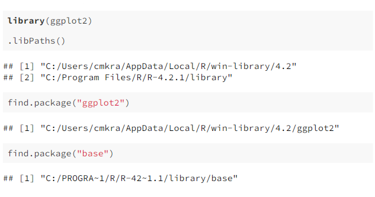
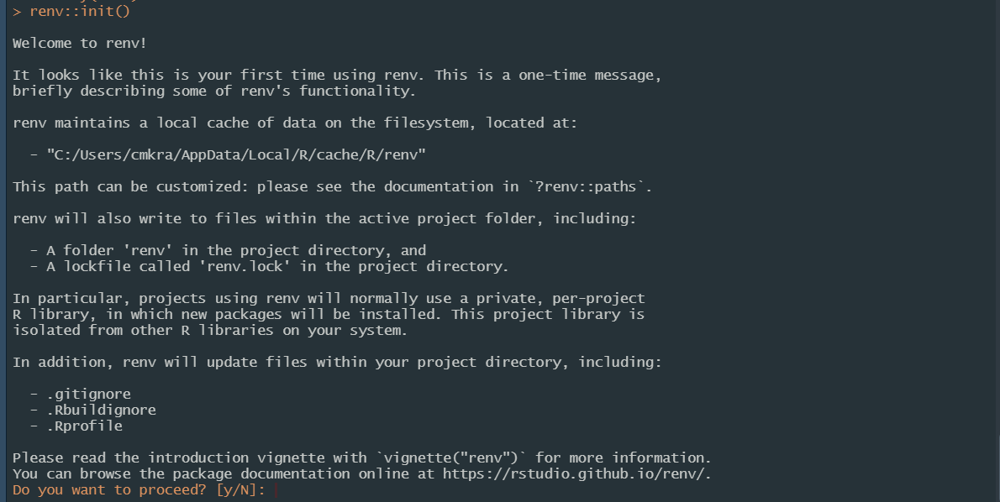
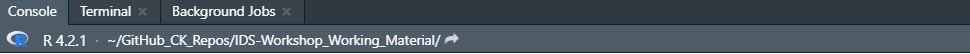

```{r setup, include=FALSE}
options(htmltools.dir.version = FALSE)
```


# Agenda

### Introduction to package management
- Problems of project reproducibility
- `renv` to the rescue
- Library paths and dependencies

### Getting to know `renv`
- `renv` functionalities
- Advantages and limitations
- References
- Tutorial setup


---

class: inverse, middle, center

# Introduction to package management

---

# Problems of project reproducibility

Making code (and findings) **reproducible** is a major part of working transparently in science. <br> Unfortunately, errors can be an issue despite good intentions. What are problems that come up when opening a foreign or older project, trying to run its code:

* our local system may be using incompatible package versions
* the project does not contain information on required package (versions)
* our system or software we use is incompatible 

These issues can lead to the script throwing errors, plots looking differently, or even different results altogether (in case the code runs). <br><br>
Even **worse**: now all  other projects will work with the older package versions which were just installed - so they may start throwing errors as well! 

---

# `renv` to the rescue! 

`renv` is a package that solves many of the issues when using R. 

* It is a **version control** for R packages.


* Even better: with `renv` R  switches from using one library for all projects, to using **project-local libraries** for R packages.


* This means: multiple package versions can co-exist simultaneously in different projects. 

---
# What is a library? 


A library (path) is a directory into which packages are installed. 

`.libPaths()` shows the active library paths. 
<br>
Without using `renv` we usually see a **user specific** library path and a **system specific** library path. 

```{undefined echo=FALSE}

knitr::include_graphics("/pics/library_paths_without_renv.png", width = "80%")


```
.center[]


```{r eval=FALSE, include=FALSE}

library(ggplot2)

.libPaths()

find.package("ggplot2")

find.package("base")


```


???
Here we see that we have the two paths (user and system). Usually packages that are not in the base R setup, will be installed (and called from) the user library. But this also shows us: every package has the same directory path and they cannot be different across projects.
---


# One library to rule them all


.footnote[ Image credit: [Kevin Ushey](https://github.com/kevinushey/2020-rstudio-conf/blob/a69566f48b345acc6a0ce9b0b158122001c4c155/img/shared-library.svg)]

---

# Libraries: the tool box for R users

.pull-left[ Your library is like a tool box: 
<br>
it gives you all the tools (packages) you need to get useful functions, well-structured tables or nice-looking plots.
<br>

`renv` ensures that your tool box always contains exactly what you need. 
]

.pull-right[ 


```{undefined echo=FALSE, out.width= "300px", out.height = "300px"}

knitr::include_graphics("/pics/toolbox.png")


```
.center[]

.footnote[ Image credit: [Google Images ](https:://werkzeugkoffer-shop.de)]

]
---

# Dependencies

A dependency is code that our script needs to run. This can mean
* packages that we call and use directly in our script
* as well as code (packages) that these packages need for them to work. 

In `R` projects, the `description` file is often used to list the dependencies of a project.  

But with `renv` we have an easy-to-use dependency management system for `R`. 


---
background-image: url(https://raw.githubusercontent.com/kevinushey/2020-rstudio-conf/master/img/project-library.svg)


# Package version control with `renv`

.footnote[ Image credit: [Kevin Ushey](https://raw.githubusercontent.com/kevinushey/2020-rstudio-conf/master/img/project-library.svg)]


---
background-image: url(https://raw.githubusercontent.com/kevinushey/2020-rstudio-conf/master/img/package-cache.svg)


# The global package cache

.footnote[ Image credit: [Kevin Ushey](https://raw.githubusercontent.com/kevinushey/2020-rstudio-conf/master/img/package-cache.svg)]


---
class: inverse, middle, center

# Getting to know `renv`

---

# Activating `renv` for a project

When setting up a new project, we can use `renv::init()`. 

```{r, include=FALSE}
library(renv)


```

```{r eval=FALSE, include=FALSE}
library(renv)
renv:: init()


```


```{undefined echo=FALSE}

knitr::include_graphics("/pics/calling_renv.png")


```
.center[]

---

# Functionality of renv::init()

Init() **combines** several functions from the `renv ` package. 
* It will check which package dependencies within the `R` file used in the current project exist. The function `dependencies()` has the same effect.
* All discovered packages are then stored in the `renv` global package cache
* Missing (but required) `R` packages are installed in the project-local library, i.e. the library path has now changed for this project.

```{r, collapse=TRUE}


.libPaths()
```


???
show in R or the file system what files have been created.

---
# Functionality of renv::init()

The following files and folders will be created:

1. A folder called **renv** will be added to the project, containing the **local library**, the .gitignore file (ensuring your local library will not be uploaded to GitHub) and a settings file.
2. The **lockfile** renv.lock contains the state of a project's library at some point in time.
It includes the **names of required packages** for the active project, their **versions** and **sources**.
3. The file .Rprofile : This file will run the R script renv/activate.R, loading the project when a new `R` session is launched.  


```{undefined echo=FALSE}

knitr::include_graphics("/pics/Console_change_with_renv_active.png")


```

Finally, your working directory should now be set to your project. 
<br>

.center[]

```{r, collapse=TRUE}
renv::project()

```

???
A folder called "renv" will be added to the project folder as well as the 
2. **lockfile** renv.lock : is the lockfile (written as .json) containing the state of a project's library at some point in time, including the names of required packages for the active project, their versions and sources. The function `snapshot()` has the same effect, saving the state of a project's library. 
*The newly created `renv folder` contains the local library, the .gitignore file (ensuring your local library will not be uploaded to GitHub) and a settings file.
* .Rprofile : This file will run `renv/activate.R`, an R script for loading the project when a new `R` session is launched.  
*  

Apart from checking whether `init()` worked properly by a) checking the project folder, you can also b) see your working directory of the project right next to the information on your RStudio version above the console.

---

# Save current project libraries 

`Snapshot()` is the function you need to remember when you are working in your project. 
<br>It saves an image of the current packages that are required for your script. 

Main arguments: 
* **project** determines which working directory is to be used. NULL = active project will be used.
* **library** determines which `R` libraries to snapshot. The default is the library reported by .libPaths()
* **type** determines the scope of included packages in the lockfile:
<br> explicit, implicit, all

???
show the renv.lock on the computer and open it. 


type = the types are ranging from packages that are explicitly listed in a project description file to all packages that are within the active `R`libraries in the lockfile. The default is "implicit", only capturing packages that are used in the project.
You can check out the snapshot() function for yourself here: (https://rstudio.github.io/renv/reference/snapshot.html). 
---

# Functionality of snapshot()

.pull-left[

Saving the current project state to the lockfile:
<br><br>
```{r, eval=FALSE}
snapshot()

renv::remove("ggplot2")

renv::status()

renv::install("ggplot2")


```
]

.pull-right[
Restoring the lockfile that we just saved, thereby reverting to the last image of required packages:
```{r, eval=FALSE}

renv::remove("ggplot2")

renv::status()

renv::restore()


```
]
---

# Git/Git Hub and `renv`

To make use of the version control of the project's state, the project needs to tbe linked to Git/GitHub

Make sure to commit the following files: 
* .Rprofile
* renv.lock file
* renv directory

Calling `renv::history()` will now show the prior commits of the lockfile to GitHub

```{r, eval=FALSE}

renv:: history()


```

`renv::revert()` completes the version control functionality, as it allows to revert back to an older lockfile that has been committed previously.

---

# Quick recap

Congratulations! You now know:

1. How create a renv-project with a project-library (`init()`), 
2. How to load a project-dependent library for a project you want to work on (`restore()`) 
3. How to update the lockfile as you continue working on the project (`snapshot()`) + git commit), and
4. How to go back to an older lockfile version, when updated packages start throwing errors (`revert()`). 


---
# Advantages and limitations of `renv`

.pull-left[

The package version control lockfiles offer are very useful: 

* freezing your project's state makes taking a break from your project and returning later easy
* sharing the project's state in teams facilitates working collaboratively
* transferring all required information for replication of your project is simplified
]
.pull-left[
But `renv` also has limitations:
* Problems with updating packages that do not stem from the typical sources such as GitHub or CRAN, although it can install packages from other sources. 
* doesn't solve all issues of reproducibility of a project: different R versions, operator differences and other issues can still cause errors. 
]


.center[Fortunately, other packages have been created for these other issues: Check out [Docker] (https://github.com/rocker-org/rocker) if you are interested to find out more.]

???
Limitations: 
* Problems with updating packages that do not stem from the typical sources such as GitHub or CRAN, although it can install packages from other sources. 
* It does does not solve all issues with reproducibility of a project: R version differences, operator differences and other issues can still cause errors. Fortunately, other packages have been created for this as well. 
---
# References
1. [Ushey K (2022). _renv: Project Environments_. R package version 0.16.0](https://CRAN.R-project.org/package=renv)
2. [Xie Y (2022). _xaringan: Presentation Ninja_. R package version 0.27](https://CRAN.R-project.org/package=xaringan)
3. [Xie Y (2022). _xaringan: Presentations](https://slides.yihui.org/xaringan/#39)
4. [Ushey K (2022). _ Overview_Renv_a](https://rstudio.github.io/renv/articles/renv.html#shims)
5. [Ushey K (2022). _ Overview_Renv_b](https://rstudio.github.io/renv/)
6. [Ushey K (2022). _ Vignette_Renv](https://github.com/rstudio/renv/blob/HEAD/vignettes/faq.Rmd)
7.  [Ushey K (2022). _ Vignette_Renv](https://rstudio.github.io/renv/reference/history.html)
8. [Ushey K (2022). _ Vignette_Renv](https://rstudio.github.io/renv/reference/init.html)
9. [EcoHealthAlliance](https://ecohealthalliance.github.io/targets-renv-example/outputs/renv-presentation.html#10)
10. [Ushey K (2020). Rstudio_conference_renv](https://github.com/kevinushey/2020-rstudio-conf) 
11. [Riffomonas Project: Using renv to track the version of your packages in R (CC29)](https://www.youtube.com/watch?v=yc7ZB4F_dc0) 
12. [Hester J: It depends - A dialogue about dependencies](https://www.tidyverse.org/blog/2019/05/itdepends/)
13.  [Wickham H, Bryan J: R packages. Dependencies: What does your package need?](https://r-pkgs.org/dependencies.html)


---

class: inverse, middle, center

# See you in the live workshop!


---
# Tutorial setup

1. Go to the workshop repository of this session (#17)
2. Clone the repository via GitHubDesktop
3. Open the Rmd file: 17-renv-practice-code
4. Save it in a new folder on your computer and close R
5. Open the newly saved file in the newly created folder
6. check getwd()


---

class: center, middle

# Thanks!

Slides created via the R package [**xaringan**](https://github.com/yihui/xaringan).

The chakra comes from [remark.js](https://remarkjs.com), [**knitr**](https://yihui.org/knitr/), and [R Markdown](https://rmarkdown.rstudio.com).
