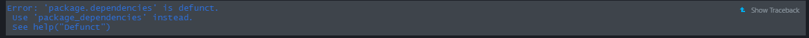
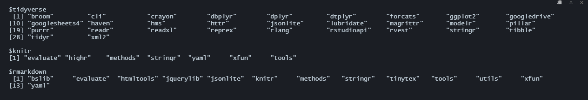

```{r setup, include=FALSE}
knitr::opts_chunk$set(echo = TRUE, message = FALSE, warning = FALSE)
```

# Before we start...

## Step 1. Where are our packages located?

```{r}

.libPaths()

```

To be more specific, let's check the location of each one of our packages:

```{r}

library(tidyverse) 
library(knitr) 
library(rmarkdown)

# We will use the find.package function:

find.package("tidyverse") 
find.package("knitr")
find.package("rmarkdown")

```

**Quick note about dependencies:** they are the code ran by the packages. People can modify them to improve a package and reduce bugs, but these changes may cause them to break and can also take additional disk space and installation time. This is why the dependencies of a package created *n* years ago might not be the same as the ones the package has today, and most likely, they'll keep changing in the future.

We can check a package's dependencies by storing our available packages in a matrix, and then using tools' package.dependencies function:

```{r eval=FALSE}

library(tools)

packs <- available.packages()

tools::package.dependencies(packs, check = T, depLevel = c("Depends"))

```

```{r, fig.align='center', echo=F, out.width = "100%"}

```

Notice the error message when we try to use package.dependencies. Fortunately, there is a newer version:

```{r eval=FALSE}

tools::package_dependencies("tidyverse", packs) 
tools::package_dependencies("knitr", packs) 
tools::package_dependencies("rmarkdown", packs)

```
```{r, fig.align='center', echo=F, out.width = "100%"}

```

Now we can see the dependencies and subpackages included in our packages, but...

*Can we do anything to preserve our packages and their dependencies, so they keep working in the future?*

# ***YES!!!*** **WELCOME TO `renv`**

## 2. Activate `renv`

```{r}

library(renv)

renv::init()

```

`renv` is now running into our project and is located in the same directory as our R file. It has created new files in our directory:

-   renv (library)
-   renv.lock (*lock*file)
-   .Rprofile (file)

So, where are our packages and dependencies now?

```{r}

.libPaths()

renv::dependencies()

```

Our packages repository and their dependencies are now part of our project, and our project will locate its packages in the `renv` folder from now on. 

*Before going further:* Restart RStudio and check how the start info has changed. We can also use `renv::project` to check where is the project we are working on.

```{r}

renv::project()

```

## 3. Manipulating renv

### 3.1 Saving the current project packages:

```{r}

renv::snapshot()

```

`renv` takes automatic snapshots of our project. If for whatever reason you would need to disable it, you can do it with the following function:

```{r}

getOption("renv.config.auto.snapshot") 
options(renv.config.auto.snapshot = FALSE)

```

To reactivate it:

```{r}

options(renv.config.auto.snapshot = TRUE)

```

### 3.2 Retrieve the packages stored in the renv.lock

```{r}

renv::restore()

```

### 3.3 We can also check the status of our stored packages and compare them with R's versions

```{r}

renv::status()

```


### 3.4 If you ever need to update a package stored in renv, you can use the update(function)

```{r}

renv::update(packages = "tidyverse", library = "/17-Ensuring_reproducibilty_with_renv-Kratzke-Vargas/renv/library/R-4.2/x86_64-w64-mingw32")

```

Also, if you know a specific version you would like to install, you can do it with the `renv:install` function

```{r}

renv::install("tidyverse@1.3.1") # tidyverse current version is 1.3.2

# So, what's changed?

renv::status() 
renv::snapshot()

```

## 4. Version Control

Last but not least, if you are working with version control you can check the history of the changes made in your renv library

```{r}

renv::history()

# Notice the commits and their subjects.

```

# Further Practice:

1. Clone this repository: https://github.com/Rpita623/Movie-Recommendation-System-using-R_Project
2. Open the rmd file
3. Before installing the packages call renv and initialize it
