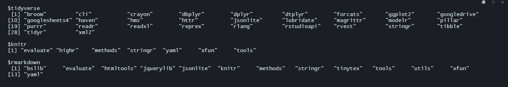

# Before we start...

## Step 1. Where are our packages located?


```r
.libPaths()
```

```
## [1] "C:/Users/darth/OneDrive - CIDE/Tercer Semestre-DESKTOP-FJT75QH/Data Science/R/Final_versions_Workshop/renv/library/R-4.2/x86_64-w64-mingw32"
## [2] "C:/Users/darth/AppData/Local/Temp/RtmpOC4u9J/renv-system-library"
```

To be more specific, let's check the location of each one of our packages:


```r
library(tidyverse) 
library(knitr) 
library(rmarkdown)

# We will use the find.package function:

find.package("tidyverse") 
```

```
## [1] "C:/Users/darth/AppData/Local/R/cache/R/renv/cache/v5/R-4.2/x86_64-w64-mingw32/tidyverse/1.3.1/fc4c72b6ae9bb283416bd59a3303bbab/tidyverse"
```

```r
find.package("knitr")
```

```
## [1] "C:/Users/darth/AppData/Local/R/cache/R/renv/cache/v5/R-4.2/x86_64-w64-mingw32/knitr/1.40/caea8b0f899a0b1738444b9bc47067e7/knitr"
```

```r
find.package("rmarkdown")
```

```
## [1] "C:/Users/darth/AppData/Local/R/cache/R/renv/cache/v5/R-4.2/x86_64-w64-mingw32/rmarkdown/2.16/0f3eaa1547e2c6880d4de1c043ac6826/rmarkdown"
```

**Quick note about dependencies:** they are the code ran by the packages. People can modify them to improve a package and reduce bugs, but these changes may cause them to break and can also take additional disk space and installation time. This is why the dependencies of a package created *n* years ago might not be the same as the ones the package has today, and most likely, they'll keep changing in the future.

We can check a package's dependencies by storing our available packages in a matrix, and then using tools' package.dependencies function:


```r
library(tools)

packs <- available.packages()

tools::package.dependencies(packs, check = T, depLevel = c("Depends"))
```


Notice the error message when we try to use package.dependencies. Fortunately, there is a newer version:


```r
tools::package_dependencies("tidyverse", packs) 
tools::package_dependencies("knitr", packs) 
tools::package_dependencies("rmarkdown", packs)
```


Now we can see the dependencies and subpackages included in our packages, but...

*Can we do anything to preserve our packages and their dependencies, so they keep working in the future?*

# ***YES!!!*** **WELCOME TO `renv`**

## 2. Activate `renv`


```r
library(renv)

renv::init()
```

`renv` is now running into our project and is located in the same directory as our R file. It has created new files in our directory:

-   renv (library)
-   renv.lock (*lock*file)
-   .Rprofile (file)

So, where are our packages and dependencies now?


```r
.libPaths()
```

```
## [1] "C:/Users/darth/OneDrive - CIDE/Tercer Semestre-DESKTOP-FJT75QH/Data Science/R/Final_versions_Workshop/renv/library/R-4.2/x86_64-w64-mingw32"
## [2] "C:/Users/darth/AppData/Local/Temp/RtmpOC4u9J/renv-system-library"
```

```r
renv::dependencies()
```

```
## Finding R package dependencies ... Done!
```

<div data-pagedtable="false">
  <script data-pagedtable-source type="application/json">
{"columns":[{"label":[""],"name":["_rn_"],"type":[""],"align":["left"]},{"label":["Source"],"name":[1],"type":["chr"],"align":["left"]},{"label":["Package"],"name":[2],"type":["chr"],"align":["left"]},{"label":["Require"],"name":[3],"type":["chr"],"align":["left"]},{"label":["Version"],"name":[4],"type":["chr"],"align":["left"]},{"label":["Dev"],"name":[5],"type":["lgl"],"align":["right"]}],"data":[{"1":"C:/Users/darth/OneDrive - CIDE/Tercer Semestre-DESKTOP-FJT75QH/Data Science/R/Final_versions_Workshop/17-renv-practice-code.Rmd","2":"rmarkdown","3":"","4":"","5":"FALSE","_rn_":"1"},{"1":"C:/Users/darth/OneDrive - CIDE/Tercer Semestre-DESKTOP-FJT75QH/Data Science/R/Final_versions_Workshop/17-renv-practice-code.Rmd","2":"knitr","3":"","4":"","5":"FALSE","_rn_":"2"},{"1":"C:/Users/darth/OneDrive - CIDE/Tercer Semestre-DESKTOP-FJT75QH/Data Science/R/Final_versions_Workshop/17-renv-practice-code.Rmd","2":"knitr","3":"","4":"","5":"FALSE","_rn_":"3"},{"1":"C:/Users/darth/OneDrive - CIDE/Tercer Semestre-DESKTOP-FJT75QH/Data Science/R/Final_versions_Workshop/17-renv-practice-code.Rmd","2":"rmarkdown","3":"","4":"","5":"FALSE","_rn_":"4"},{"1":"C:/Users/darth/OneDrive - CIDE/Tercer Semestre-DESKTOP-FJT75QH/Data Science/R/Final_versions_Workshop/17-renv-practice-code.Rmd","2":"tidyverse","3":"","4":"","5":"FALSE","_rn_":"5"},{"1":"C:/Users/darth/OneDrive - CIDE/Tercer Semestre-DESKTOP-FJT75QH/Data Science/R/Final_versions_Workshop/17-renv-practice-code.Rmd","2":"knitr","3":"","4":"","5":"FALSE","_rn_":"6"},{"1":"C:/Users/darth/OneDrive - CIDE/Tercer Semestre-DESKTOP-FJT75QH/Data Science/R/Final_versions_Workshop/17-renv-practice-code.Rmd","2":"knitr","3":"","4":"","5":"FALSE","_rn_":"7"},{"1":"C:/Users/darth/OneDrive - CIDE/Tercer Semestre-DESKTOP-FJT75QH/Data Science/R/Final_versions_Workshop/17-renv-practice-code.Rmd","2":"renv","3":"","4":"","5":"FALSE","_rn_":"8"},{"1":"C:/Users/darth/OneDrive - CIDE/Tercer Semestre-DESKTOP-FJT75QH/Data Science/R/Final_versions_Workshop/17-renv-practice-code.Rmd","2":"renv","3":"","4":"","5":"FALSE","_rn_":"9"},{"1":"C:/Users/darth/OneDrive - CIDE/Tercer Semestre-DESKTOP-FJT75QH/Data Science/R/Final_versions_Workshop/17-renv-practice-code.Rmd","2":"renv","3":"","4":"","5":"FALSE","_rn_":"10"},{"1":"C:/Users/darth/OneDrive - CIDE/Tercer Semestre-DESKTOP-FJT75QH/Data Science/R/Final_versions_Workshop/17-renv-practice-code.Rmd","2":"renv","3":"","4":"","5":"FALSE","_rn_":"11"},{"1":"C:/Users/darth/OneDrive - CIDE/Tercer Semestre-DESKTOP-FJT75QH/Data Science/R/Final_versions_Workshop/17-renv-practice-code.Rmd","2":"renv","3":"","4":"","5":"FALSE","_rn_":"12"},{"1":"C:/Users/darth/OneDrive - CIDE/Tercer Semestre-DESKTOP-FJT75QH/Data Science/R/Final_versions_Workshop/17-renv-practice-code.Rmd","2":"renv","3":"","4":"","5":"FALSE","_rn_":"13"},{"1":"C:/Users/darth/OneDrive - CIDE/Tercer Semestre-DESKTOP-FJT75QH/Data Science/R/Final_versions_Workshop/17-renv-practice-code.Rmd","2":"renv","3":"","4":"","5":"FALSE","_rn_":"14"},{"1":"C:/Users/darth/OneDrive - CIDE/Tercer Semestre-DESKTOP-FJT75QH/Data Science/R/Final_versions_Workshop/17-renv-practice-code.Rmd","2":"renv","3":"","4":"","5":"FALSE","_rn_":"15"},{"1":"C:/Users/darth/OneDrive - CIDE/Tercer Semestre-DESKTOP-FJT75QH/Data Science/R/Final_versions_Workshop/17-renv-practice-code.Rmd","2":"renv","3":"","4":"","5":"FALSE","_rn_":"16"},{"1":"C:/Users/darth/OneDrive - CIDE/Tercer Semestre-DESKTOP-FJT75QH/Data Science/R/Final_versions_Workshop/17_Presentation_Reproducibility_with_renv_Kratzke_Vargas.Rmd","2":"rmarkdown","3":"","4":"","5":"FALSE","_rn_":"17"},{"1":"C:/Users/darth/OneDrive - CIDE/Tercer Semestre-DESKTOP-FJT75QH/Data Science/R/Final_versions_Workshop/17_Presentation_Reproducibility_with_renv_Kratzke_Vargas.Rmd","2":"xaringan","3":"","4":"","5":"FALSE","_rn_":"18"},{"1":"C:/Users/darth/OneDrive - CIDE/Tercer Semestre-DESKTOP-FJT75QH/Data Science/R/Final_versions_Workshop/17_Presentation_Reproducibility_with_renv_Kratzke_Vargas.Rmd","2":"renv","3":"","4":"","5":"FALSE","_rn_":"19"},{"1":"C:/Users/darth/OneDrive - CIDE/Tercer Semestre-DESKTOP-FJT75QH/Data Science/R/Final_versions_Workshop/17_Presentation_Reproducibility_with_renv_Kratzke_Vargas.Rmd","2":"renv","3":"","4":"","5":"FALSE","_rn_":"20"},{"1":"C:/Users/darth/OneDrive - CIDE/Tercer Semestre-DESKTOP-FJT75QH/Data Science/R/Final_versions_Workshop/renv.lock","2":"renv","3":"","4":"","5":"FALSE","_rn_":"21"}],"options":{"columns":{"min":{},"max":[10]},"rows":{"min":[10],"max":[10]},"pages":{}}}
  </script>
</div>

Our packages repository and their dependencies are now part of our project, and our project will locate its packages in the `renv` folder from now on. 

*Before going further:* Restart RStudio and check how the start info has changed. We can also use `renv::project` to check where is the project we are working on.


```r
renv::project()
```

```
## [1] "C:/Users/darth/OneDrive - CIDE/Tercer Semestre-DESKTOP-FJT75QH/Data Science/R/Final_versions_Workshop"
```

## 3. Manipulating renv

### 3.1 Saving the current project packages:


```r
renv::snapshot()
```

```
## * Lockfile written to 'C:/Users/darth/OneDrive - CIDE/Tercer Semestre-DESKTOP-FJT75QH/Data Science/R/Final_versions_Workshop/renv.lock'.
```

`renv` takes automatic snapshots of our project. If for whatever reason you would need to disable it, you can do it with the following function:


```r
getOption("renv.config.auto.snapshot") 
```

```
## NULL
```

```r
options(renv.config.auto.snapshot = FALSE)
```

To reactivate it:


```r
options(renv.config.auto.snapshot = TRUE)
```

### 3.2 Retrieve the packages stored in the renv.lock


```r
renv::restore()
```

```
## * The library is already synchronized with the lockfile.
```

### 3.3 We can also check the status of our stored packages and compare them with R's versions


```r
renv::status()
```

```
## * The project is already synchronized with the lockfile.
```


### 3.4 If you ever need to update a package stored in renv, you can use the update(function)


```r
renv::update(packages = "tidyverse", library = "/IDS-Workshop_Working_Material.Rproj/renv/library/R-4.2/x86_64-w64-mingw32")
```

```
## * Checking for updated packages ... Done!
## * All packages appear to be up-to-date.
```

Also, if you know a specific version you would like to install, you can do it with the `renv:install` function


```r
renv::install("tidyverse@1.3.1") # tidyverse current version is 1.3.2
```

```
## Installing tidyverse [1.3.1] ...
## 	OK [linked cache]
```

```r
# So, what's changed?

renv::status() 
```

```
## * The project is already synchronized with the lockfile.
```

```r
renv::snapshot()
```

```
## * Lockfile written to 'C:/Users/darth/OneDrive - CIDE/Tercer Semestre-DESKTOP-FJT75QH/Data Science/R/Final_versions_Workshop/renv.lock'.
```

## 4. Version Control

Last but not least, if you are working with version control you can check the history of the changes made in your renv library


```r
renv::history()
```

```
## $author_date
## POSIXct of length 0
## 
## $committer_date
## POSIXct of length 0
```

```r
# Notice the commits and their subjects.
```

# Further Practice:

1. Clone this repository: https://github.com/Rpita623/Movie-Recommendation-System-using-R_Project
2. Open the rmd file
3. Before installing the packages call renv and initialize it
